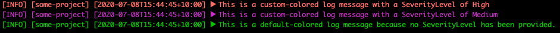

# Common logutil

The logutil package is useful for maintaining a consistent log format across our analyzers.

## Example usage

```golang
import (
  "gitlab.com/gitlab-org/security-products/analyzers/common/v2/logutil"
  log "github.com/sirupsen/logrus"
)

func main() {
        log.SetFormatter(&logutil.Formatter{})
        log.Info("foo")
        log.SetFormatter(&logutil.Formatter{Project:"secrets"})
        log.Info("bar")
        log.SetFormatter(&logutil.Formatter{Project:"secrets", TimestampFormat:time.RFC3339Nano})
        log.Info("baz")


        // resetting to default
        log.SetFormatter(&logutil.Formatter{})
        log.Debug("foo")
        log.Info("foo")
        log.Warn("bar")
        log.Error("baz")
        log.Fatalf("goodbye %s", "world")
}
```

### Output

```
[INFO] [Sun, 15 Mar 2020 10:18:08 EDT] ▶ foo
[INFO] [secrets] [Sun, 15 Mar 2020 10:18:08 EDT] ▶ bar
[INFO] [secrets] [2020-03-15T10:18:08.305231-04:00] ▶ baz
[INFO] [Sun, 15 Mar 2020 10:18:08 EDT] ▶ foo
[WARN] [Sun, 15 Mar 2020 10:18:08 EDT] ▶ bar
[ERRO] [Sun, 15 Mar 2020 10:18:08 EDT] ▶ baz
[FATA] [Sun, 15 Mar 2020 10:18:08 EDT] ▶ goodbye world
```

## Providing a custom logging format

It's possible to override the logging format to provide your own custom format:

```golang
package main

import (
	"fmt"

	log "github.com/sirupsen/logrus"
)

type MyCustomFormatter struct {
	CustomPrefix string
}

func (f *MyCustomFormatter) Format(entry *log.Entry) ([]byte, error) {
	logMsg := fmt.Sprintf("[%s %s]: %s\n", f.CustomPrefix, entry.Level, entry.Message)

	return []byte(logMsg), nil
}

func main() {
	log.SetFormatter(&MyCustomFormatter{CustomPrefix: "some-prefix"})
	log.Info("foo")
}
```

### Output

```
[some-prefix info]: foo
```

## Conditionally providing a custom logging format

It's also possible to provide a custom logging format if some condition has been set, otherwise, fall back to the default logging format defined by the common package:

```golang
package main

import (
	"github.com/sirupsen/logrus"
	log "github.com/sirupsen/logrus"

	"github.com/logrusorgru/aurora"

	"gitlab.com/gitlab-org/security-products/analyzers/common/v2/issue"
	"gitlab.com/gitlab-org/security-products/analyzers/common/v2/logutil"
)

type VulnerabilityFormatter struct {
	Project string
}

type decorator func(string) aurora.Value

func (f *VulnerabilityFormatter) Format(entry *log.Entry) ([]byte, error) {
	severityLevel := entry.Data["SeverityLevel"]

	// the log message using the default format provided by the common logutil package
	defaultColoredLogutilMsg, err := (&logutil.Formatter{Project: f.Project}).Format(entry)
	if err != nil {
		return nil, err
	}

	// a custom severityLevel hasn't been passed, use the default format
	if severityLevel == nil {
		return defaultColoredLogutilMsg, nil
	}

	var logColor decorator
	switch severityLevel {
	case issue.SeverityLevelUnknown:
		logColor = func(in string) aurora.Value { return aurora.BrightBlue(in) }
	case issue.SeverityLevelInfo:
		logColor = func(in string) aurora.Value { return aurora.Green(in) }
	case issue.SeverityLevelLow:
		logColor = func(in string) aurora.Value { return aurora.Yellow(in) }
	case issue.SeverityLevelMedium:
		logColor = func(in string) aurora.Value { return aurora.Magenta(in) }
	case issue.SeverityLevelHigh:
		logColor = func(in string) aurora.Value { return aurora.BrightRed(in) }
	case issue.SeverityLevelCritical:
		logColor = func(in string) aurora.Value { return aurora.Red(in) }
	}

	// strip the ANSI color escape codes from the logutil formatted msg
	defaultLogutilMsg := string(defaultColoredLogutilMsg)[7:len(defaultColoredLogutilMsg)]

	// provide a custom color for the log message, based on the severityLevel of the vulnerability
	coloredLogMsg := logColor(defaultLogutilMsg)

	return []byte(coloredLogMsg.String()), nil
}

func main() {
	log.SetFormatter(&VulnerabilityFormatter{Project: "some-project"})

	log.WithFields(logrus.Fields{
		"SeverityLevel": issue.SeverityLevelHigh,
	}).Infof("This is a custom-colored log message with a SeverityLevel of %s", "High")

	log.WithFields(logrus.Fields{
		"SeverityLevel": issue.SeverityLevelMedium,
	}).Infof("This is a custom-colored log message with a SeverityLevel of %s", "Medium")

	log.Infof("This is a default-colored log message because no SeverityLevel has been provided.")
}
```

### Output


